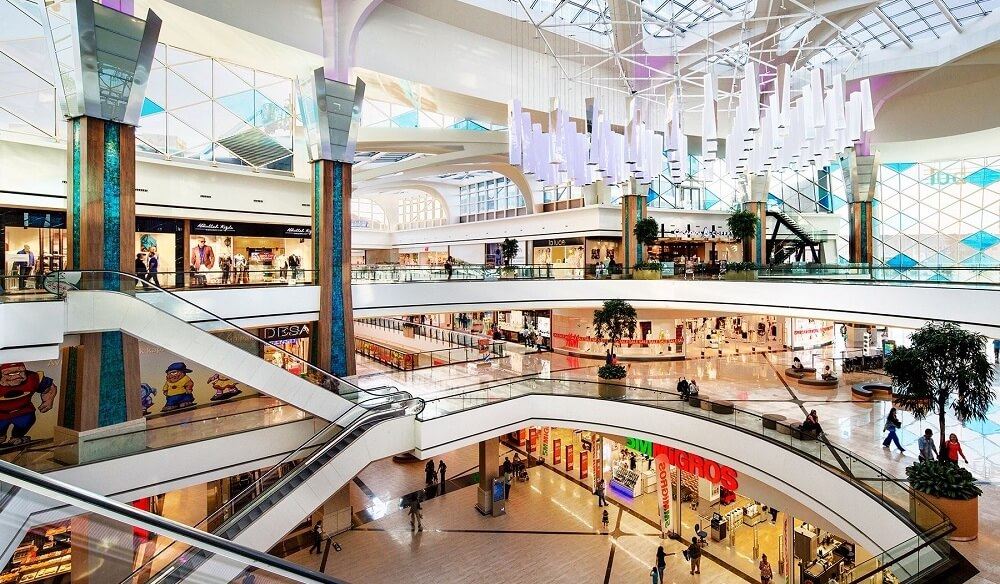

# Market-Basket-Analysis

Source of the Dataset: https://www.kaggle.com/datasets/mehmettahiraslan/customer-shopping-dataset

Read the Paper: https://github.com/rkellazar/Market-Basket-Analysis/blob/main/istanbul_mall.pdf

## Introduction

The dataset being introduced contains shopping information from 10 different shopping malls between 2021 and 2023. The data was gathered from various age groups and genders, providing a comprehensive view ofshopping habits in Istanbul.

Included in the dataset are essential pieces of information such as Invoice numbers, Customer IDs, Age,Gender, Payment methods, Product categories, Quantity, Price, Order dates, and Shopping mall locations.

I should note that the dataset presented is intended for exploratory analysis purposes. As such, I believe it can serve as a starting point for further investigation into shopping behaviors in Istanbul. I intend to approach the data with an open mind, as the patterns and trends I uncover may be unexpected.

## Conclusions

In conlusion, the analysis of the shopping data from various malls in Istanbul has provided insights into the shopping behavior and preferences of customers across different categories. The top three categories that customers buy across all malls are Clothing, Food & Beverage, and Cosmetics, while the least bought categories are Technology, Books, and Souvenir. This indicates that there are certain categories that are more popular and profitable for businesses operating in these malls.

Mall of Istanbul and Kanyon are the top two malls in terms of generating the most revenue and attracting the highest number of female and male customers. This makes them a prime location for businesses looking to expand or launch new products in Istanbul. On the other hand, Cevahir AVM, Viaport Outlet, Emaar Square Mall, and Forum Istanbul are at the bottom of the list in terms of total sales, which suggests that they may need to revise their marketing strategies or product offerings to attract more customers and increase sales.

Furthermore, the data shows that female shoppers tend to purchase a larger quantity of items than male shoppers across all categories. Clothing, Shoes, and Technology are the most profitable categories, while Cosmetics, Toys, Food & Beverage, Books, and Souvenir have lower total sales. These findings provide useful information for businesses looking to tailer their product offerings and marketing strategies to maximize their sales and revenue potential in the Istanbul shopping market.

Overall, this analysis highlights the importance of understanding customers shopping behavior and preferecens to make informed decisions and maximize sales and revenue potential in the competitive retail market of Istanbul.

## Next Steps

- Conducting further research to understand the reasons behind the differences in sales performance between the malls. This could involve gathering more data on customer demographics, preferences and behavior, as well as analyzing the marketing strategies and product offerings of each mall.
- Using the findings to develop targeted marketing campaigns for businesses looking to expand their customer base or launch new products in Istanbul. For example, businesses targetting female shoppers may want to consider opening stores in Mall of Istanbul and Kanyon, which were found to have the highest number of female customers.
- Considering the popularity of certain categories, such as Clothing and Cosmetics, when planning product offerings and pricing strategies. It may also be worthwhile to explore the potential of the Technology category, which generates high revenue despite being one of the least bought categories based on quantity.
- Adding location data to the analysis could be a useful next step. Location can play an important role in the popularity and sales performance of a mall, as malls situated in more densely populated or affluent areas  may see higher sales than those located in less populated or less affluent areas. By incorporating location data, we could gain a better understanding of the impact of location on mall sales and identify any patterns or trends that may exist.
