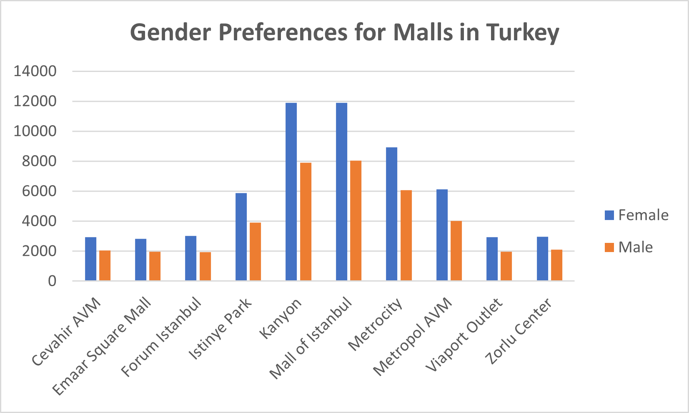
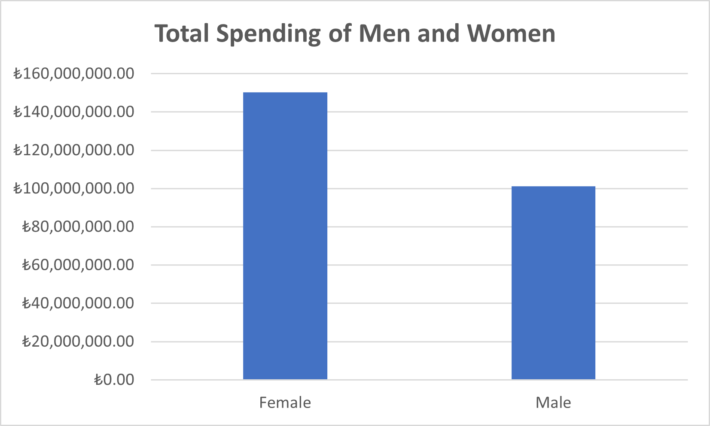
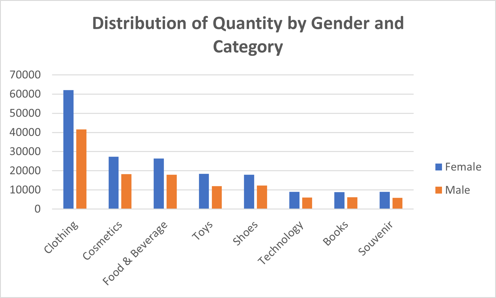
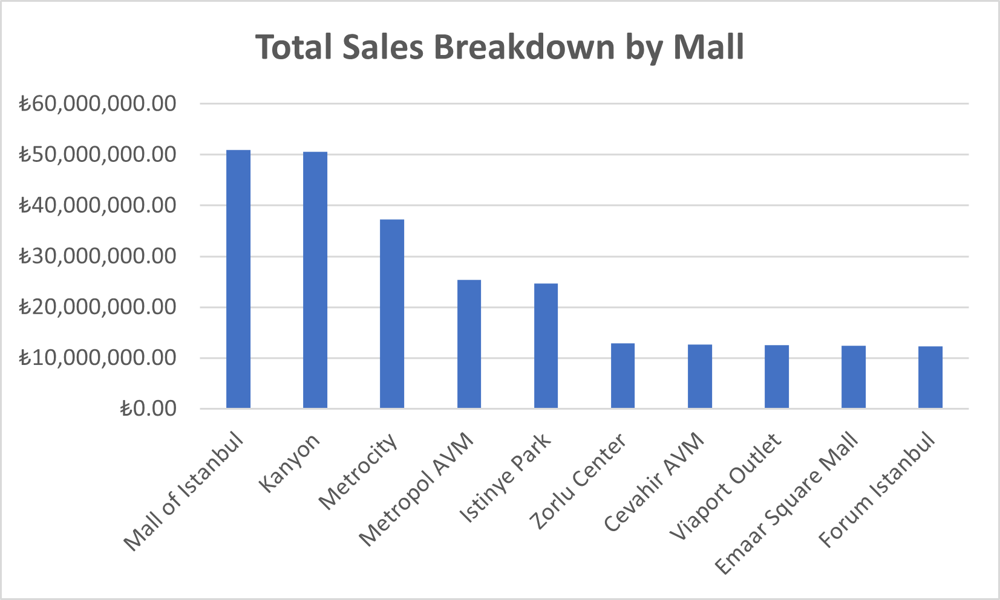

\newpage
&nbsp;

\vspace{5cm}
# Introduction

\vspace{1cm}
The dataset being introduced contains shopping information from 10 different shopping malls between 2021 and 2023. The data was gathered from various age groups and genders, providing a comprehensive view of shopping habits in Istanbul.

Included in the dataset are essential pieces of information such as Invoice numbers, Customer IDs, Age, Gender, Payment methods, Product categories, Quantity, Price, Order dates, and Shopping mall locations.

I should note that the dataset presented is intended for exploratory analysis purposes. As such, I believe it can serve as a starting point for further investigation into shopping behaviors in Istanbul. The data contained is raw and unprocessed, allowing me to develop my own unique insights and interpretations. I intend to approach the data with an open mind, as the patterns and trends I uncover may be unexpected.

\newpage
# Analysis

\vspace{1cm}
## Gender Preferences for Malls in Turkey

\vspace{2cm}

\vspace{2cm}
**Findings:**

It can be seen that Kanyon and Mall of Istanbul have the highest number of female customers, with **11,906** and **11,902** respectively, while Cevahir AVM and Emaar Square Mall have the lowest number of female customers, with **2,940** and **2,842** respectively.

On the other hand, Mall of Istanbul has the highest number of male customers with **8,041**, followed by Kanyon with **7,917** male customers. In contrast, the malls with the lowest male customer counts are Viaport Outlet and Forum Istanbul, with **1,965** and **1,931** respectively.

These findings indicate that Mall of Istanbul and Kanyon are the most popular shopping destinations for both female and male customers in Istanbul. Businesses that are looking to expand their customer base or launch new products may want to consider these malls as potential locations for their operations.

\newpage
## Total Spending of Men and Women
\vspace{2cm}

\vspace{2cm}
**Findings:**

Female mall shoppers spent significantly more than male customers during the specified time frame. This could indicate that women are more active shoppers.

But, are female shoppers purchasing expensive items or buying a larger quantity of items?

\newpage
## Distribution of Quantity by Gender and Category

\vspace{2cm}

\vspace{2cm}
**Findings:**

In all categories, it appears that female shoppers are purchasing a larger quantity of items than male shoppers. The top categories for both females and males are Clothing and Cosmetics, followed by Food & Beverage. This suggests that fashion and personal care products are some of the most popular items across genders.

The least bought items based on quantity are Books, Technology, and Souvenirs for both female and male customers. This could be due to various reasons such as the availability of e-books and online shopping for books, and the preference of customers to buy souvenirs from other locations rather than malls. And there could be several reasons why technology is the third least bought item based on quantity. One possibility is that technology products tend to be more expensive compared to other items, so even though they are bought less frequently, they may still generate significant revenue.

\newpage
## Total Sales in Each Category

\vspace{2cm}

\vspace{2cm}
**Findings:**

Clothing and Shoes are the most profitable categories, followed by Technology. Cosmetics, Toys, Food & Beverage, Books, and Souvenir have significantly lower total sales compared to the top three categories. This suggests that Clothing, Shoes and Technology are the most popular categories who are willing to spend more money on products, while the other categories may have lower price points or may not be as popular among customers.

But, On *Figure* @ref(fig:fig3) , Technology is the third least bought items based on quantity and yet it generates more revenue. One possibility is that technology products tend to have higher profit margins, meaning that even though fewer items are sold, the profit per item sold is higher. Another possibility is that technology products tend to be more expensive than other categories, which also contributes to higher revenue. Additionally, it's possible that the marketing and advertising strategies for technology products are more effective in generating sales and revenue, despite selling fewer items.

\newpage
## Quantity Breakdown of Sales by Mall Category

\vspace{2cm}

\vspace{2cm}
**Findings:**

Clothing, Food & Beverage, and Cosmetics are the top three categories, while Technology, Books, and Souvenir are the top three least bought categories based on quantity across all malls.

These malls may have different target markets, marketing strategies, or product offerings that affect their sales performance. It would be interesting to further analyze the data to understand why these malls have lower sales compared to others.

It's also worth nothing that the location of the mall can also play a role in sales, as malls situated in more densely populated or affluent areas may see higher sales than those located in less populated or less affluent areas.

\newpage
## Total Sales Breakdown by Mall
\vspace{2cm}

\vspace{2cm}
**Findings:**

Mall of Istanbul and Kanyon are the top two malls generating the most revenue. They are followed by Metrocity and Metropol AVM in the third and fourth positions respectively.

Interestingly, Zorlu Center which has the least quantity of sales in *Figure* @ref(fig:fig5), with a total quantity of **15,234** in all categories, still manages to generate significant revenue, ranking at the sixth position in terms of total sales. Cevahir AVM, Viaport Outlet, Emaar Square Mall, and Forum Istanbul are the bottom four malls in terms of total sales.

\newpage
# Conclusion

In conclusion, the analysis of the shopping data from various malls in Istanbul has provided insights into the shopping behavior and preferences of customers across different categories. The top three categories that customers buy across all malls are Clothing, Food & Beverage, and Cosmetics, while the least bought categories are Technology, Books, and Souvenir. This indicates that there are certain categories that are more popular and profitable for businesses operating in these malls.

Mall of Istanbul and Kanyon are the top two malls in terms of generating the most revenue and attracting the highest number of female and male customers. This makes them a prime location for businesses looking to expand or launch new products in Istanbul. On the other hand, Cevahir AVM, Viaport Outlet, Emaar Square Mall, and Forum Istanbul are at the bottom of the list in terms of total sales, which suggests that they may need to revise their marketing strategies or product offerings to attract more customers and increase sales.

Furthermore, the data shows that female shoppers tend to purchase a larger quantity of items than male shoppers across all categories. Clothing, Shoes, and Technology are the most profitable categories, while Cosmetics, Toys, Food & Beverage, Books, and Souvenir have lower total sales. These findings provide useful information for businesses looking to tailor their product offerings and marketing strategies to maximize their sales and revenue potential in the Istanbul shopping market.

Overall, this analysis highlights the importance of understanding customers' shopping behavior and preferences to make informed decisions and maximize sales and revenue potential in the competitive retail market of Istanbul.

\vspace{1cm}
# Next Steps

-   Conducting further research to understand the reasons behind the differences in sales performance between the malls. This could involve gathering more data on customer demographics, preferences, and behavior, as well as analyzing the marketing strategies and product offerings of each mall.

-   Using the findings to develop targeted marketing campaigns for businesses looking to expand their customer base or launch new products in Istanbul. For example, businesses targeting female shoppers may want to consider opening stores in Mall of Istanbul and Kanyon, which were found to have the highest number of female customers.

-   Considering the popularity of certain categories, such as Clothing and Cosmetics, when planning product offerings and pricing strategies. It may also be worthwhile to explore the potential of the Technology category, which generates high revenue despite being one of the least bought categories based on quantity.

-   Adding location data to the analysis could be a useful next step. Location can play an important role in the popularity and sales performance of a mall, as malls situated in more densely populated or affluent areas may see higher sales than those located in less populated or less affluent areas. By incorporating location data, we could gain a better understanding of the impact of location on mall sales and identify any patterns or trends that may exist.